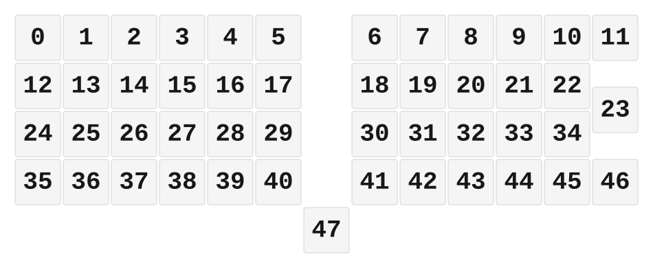

# ZMK Configuration for Feta

*Generated by Shield Wizard for ZMK*



Download compiled firmware from the Actions tab. <https://zmk.dev/docs/user-setup#installing-the-firmware>

Edit your keymap <https://zmk.dev/docs/keymaps>.
User keymap is located at [`config/feta.keymap`](config/feta.keymap).

-----

<details>
<summary>
Shield Wizard Debug Information
</summary>

In case of broken configuration, here is the Shield Wizard internal data used to generate this configuration:

Commit: 5840d41ac0915092c8fe45da617ffb4bb91e1b97

```json
{"name":"Feta","shield":"feta","dongle":false,"modules":[],"layout":[{"id":"01KPM2TJ41JRC1CQPMTKADDKZX","part":0,"row":0,"col":0,"w":1,"h":1,"x":0,"y":0,"r":0,"rx":0,"ry":0},{"id":"01KPM2TWKSMXEMR3FM0EDC09V3","part":0,"row":0,"col":1,"w":1,"h":1,"x":1,"y":0,"r":0,"rx":0,"ry":0},{"id":"01KPM2W84JF56RFA7WENQS7VBG","part":0,"row":0,"col":2,"w":1,"h":1,"x":2,"y":0,"r":0,"rx":0,"ry":0},{"id":"01KPM2WAXJG5J1KHVDNFEXD1HM","part":0,"row":0,"col":3,"w":1,"h":1,"x":3,"y":0,"r":0,"rx":0,"ry":0},{"id":"01KPM2WCH372HS74HB01KXTATR","part":0,"row":0,"col":4,"w":1,"h":1,"x":4,"y":0,"r":0,"rx":0,"ry":0},{"id":"01KPM2WECKZAM62C1KQ3GFVKHZ","part":0,"row":0,"col":5,"w":1,"h":1,"x":5,"y":0,"r":0,"rx":0,"ry":0},{"id":"01KPM2WJBBJ29XC6B6GENH1NXN","part":0,"row":0,"col":7,"w":1,"h":1,"x":7,"y":0,"r":0,"rx":0,"ry":0},{"id":"01KPM2WVC375E7FM34FBCTF6RC","part":0,"row":0,"col":8,"w":1,"h":1,"x":8,"y":0,"r":0,"rx":0,"ry":0},{"id":"01KPM2WXDV6RZKXMSWB7FJGMH5","part":0,"row":0,"col":9,"w":1,"h":1,"x":9,"y":0,"r":0,"rx":0,"ry":0},{"id":"01KPM2WXWK2MKEYF4JWVM7R7YX","part":0,"row":0,"col":10,"w":1,"h":1,"x":10,"y":0,"r":0,"rx":0,"ry":0},{"id":"01KPM2WY9VRE5BP1APSFG6SKSY","part":0,"row":0,"col":11,"w":1,"h":1,"x":11,"y":0,"r":0,"rx":0,"ry":0},{"id":"01KPM2WZ3BS16BZ3M10KGJ1G5T","part":0,"row":0,"col":12,"w":1,"h":1,"x":12,"y":0,"r":0,"rx":0,"ry":0},{"id":"01KPM2X37WVRGNKRMNSRS8JMCQ","part":0,"row":1,"col":0,"w":1,"h":1,"x":0,"y":1,"r":0,"rx":0,"ry":0},{"id":"01KPM2XT8MFWVV6A2KV7SZ7BMM","part":0,"row":1,"col":1,"w":1,"h":1,"x":1,"y":1,"r":0,"rx":0,"ry":0},{"id":"01KPM2XTKM3ND8DKVRBMM1MDRC","part":0,"row":1,"col":2,"w":1,"h":1,"x":2,"y":1,"r":0,"rx":0,"ry":0},{"id":"01KPM2XTX4MQHFZCEF09YDQ8R2","part":0,"row":1,"col":3,"w":1,"h":1,"x":3,"y":1,"r":0,"rx":0,"ry":0},{"id":"01KPM2XV5M22JZCZ16AJDCC4WP","part":0,"row":1,"col":4,"w":1,"h":1,"x":4,"y":1,"r":0,"rx":0,"ry":0},{"id":"01KPM2XVJWNKZRV2JR4RKERGDA","part":0,"row":1,"col":5,"w":1,"h":1,"x":5,"y":1,"r":0,"rx":0,"ry":0},{"id":"01KPM2YAEMWT5E9VE2J9ABP047","part":0,"row":1,"col":7,"w":1,"h":1,"x":7,"y":1,"r":0,"rx":0,"ry":0},{"id":"01KPM2YKRMTVBVXHJTKDMQVY2Y","part":0,"row":1,"col":8,"w":1,"h":1,"x":8,"y":1,"r":0,"rx":0,"ry":0},{"id":"01KPM2YMCC9WNBCVPDEBS5FYFK","part":0,"row":1,"col":9,"w":1,"h":1,"x":9,"y":1,"r":0,"rx":0,"ry":0},{"id":"01KPM2YMT4PJ6KEPTKA91CSKDF","part":0,"row":1,"col":10,"w":1,"h":1,"x":10,"y":1,"r":0,"rx":0,"ry":0},{"id":"01KPM2YN7CBWVTV3HX4Q7BE0V3","part":0,"row":1,"col":11,"w":1,"h":1,"x":11,"y":1,"r":0,"rx":0,"ry":0},{"id":"01KPM2YP3XRD44Q5WFYHRNZEPR","part":0,"row":1,"col":12,"w":1,"h":1,"x":12,"y":1.5,"r":0,"rx":0,"ry":0},{"id":"01KPM2Z4PXGG0N6VCCY5VYPQMB","part":0,"row":2,"col":0,"w":1,"h":1,"x":0,"y":2,"r":0,"rx":0,"ry":0},{"id":"01KPM2ZY7PCJSF6J41GR3DJ8WY","part":0,"row":2,"col":1,"w":1,"h":1,"x":1,"y":2,"r":0,"rx":0,"ry":0},{"id":"01KPM2ZYREJJG1NNXDNB0DGSV2","part":0,"row":2,"col":2,"w":1,"h":1,"x":2,"y":2,"r":0,"rx":0,"ry":0},{"id":"01KPM2ZZC61QVZFB0Y9AGMYE8C","part":0,"row":2,"col":3,"w":1,"h":1,"x":3,"y":2,"r":0,"rx":0,"ry":0},{"id":"01KPM2ZZZPA21N2G37MFHR5CNP","part":0,"row":2,"col":4,"w":1,"h":1,"x":4,"y":2,"r":0,"rx":0,"ry":0},{"id":"01KPM300HDSHB77R4PN89YTJ6R","part":0,"row":2,"col":5,"w":1,"h":1,"x":5,"y":2,"r":0,"rx":0,"ry":0},{"id":"01KPM30Q56YM01QKQGB3THRX4T","part":0,"row":2,"col":7,"w":1,"h":1,"x":7,"y":2,"r":0,"rx":0,"ry":0},{"id":"01KPM30QE6HRC06F66YQA79TK5","part":0,"row":2,"col":8,"w":1,"h":1,"x":8,"y":2,"r":0,"rx":0,"ry":0},{"id":"01KPM30QQEC664C20J203S1KK9","part":0,"row":2,"col":9,"w":1,"h":1,"x":9,"y":2,"r":0,"rx":0,"ry":0},{"id":"01KPM30R1QT2QHYTRECSF87Z73","part":0,"row":2,"col":10,"w":1,"h":1,"x":10,"y":2,"r":0,"rx":0,"ry":0},{"id":"01KPM30RE62T1Y5A1193TY5A20","part":0,"row":2,"col":11,"w":1,"h":1,"x":11,"y":2,"r":0,"rx":0,"ry":0},{"id":"01KPM31C1ZDTCY3Q64JD1YRRET","part":0,"row":3,"col":0,"w":1,"h":1,"x":0,"y":3,"r":0,"rx":0,"ry":0},{"id":"01KPM31C7PKXPN7Z2550JRN530","part":0,"row":3,"col":1,"w":1,"h":1,"x":1,"y":3,"r":0,"rx":0,"ry":0},{"id":"01KPM31CDCETMSHM7QGNJWG8Z8","part":0,"row":3,"col":2,"w":1,"h":1,"x":2,"y":3,"r":0,"rx":0,"ry":0},{"id":"01KPM31CKZ0D12NJVA7ZXZX8P0","part":0,"row":3,"col":3,"w":1,"h":1,"x":3,"y":3,"r":0,"rx":0,"ry":0},{"id":"01KPM31CSW4SXC9KA3413SZTHY","part":0,"row":3,"col":4,"w":1,"h":1,"x":4,"y":3,"r":0,"rx":0,"ry":0},{"id":"01KPM31CZVQ40PPYWQAKT8TYDR","part":0,"row":3,"col":5,"w":1,"h":1,"x":5,"y":3,"r":0,"rx":0,"ry":0},{"id":"01KPM31D5XA8EZBPFQ0BFQCXJ1","part":0,"row":3,"col":7,"w":1,"h":1,"x":7,"y":3,"r":0,"rx":0,"ry":0},{"id":"01KPM31DJFDXQEZZVZSAD5TD9Y","part":0,"row":3,"col":8,"w":1,"h":1,"x":8,"y":3,"r":0,"rx":0,"ry":0},{"id":"01KPM31E3F32Q0AQN19CZ5XB7X","part":0,"row":3,"col":9,"w":1,"h":1,"x":9,"y":3,"r":0,"rx":0,"ry":0},{"id":"01KPM31EA91D4Y069K09WTWYSN","part":0,"row":3,"col":10,"w":1,"h":1,"x":10,"y":3,"r":0,"rx":0,"ry":0},{"id":"01KPM31EQQ75AFD8J3VV1M9RVY","part":0,"row":3,"col":11,"w":1,"h":1,"x":11,"y":3,"r":0,"rx":0,"ry":0},{"id":"01KPM31EZSA77ZRT0FJZ897EH7","part":0,"row":3,"col":12,"w":1,"h":1,"x":12,"y":3,"r":0,"rx":0,"ry":0},{"id":"01KPM33S63F0CNMBYY65PC7ABY","part":0,"row":4,"col":6,"w":1,"h":1,"x":6,"y":4,"r":0,"rx":0,"ry":0}],"parts":[{"name":"unibody","controller":"nice_nano_v2","wiring":"matrix_diode","pins":{"d21":"input","d20":"input","d19":"input","d18":"input","d15":"input","d14":"input","d2":"output","d3":"output","d0":"output","d1":"output","d16":"input","d7":"input","d6":"input","d5":"input","d4":"input","d9":"input","d8":"input"},"keys":{"01KPM2TJ41JRC1CQPMTKADDKZX":{"input":"d21","output":"d3"},"01KPM2X37WVRGNKRMNSRS8JMCQ":{"input":"d21","output":"d2"},"01KPM2Z4PXGG0N6VCCY5VYPQMB":{"input":"d21","output":"d0"},"01KPM31C1ZDTCY3Q64JD1YRRET":{"input":"d21","output":"d1"},"01KPM2TWKSMXEMR3FM0EDC09V3":{"input":"d20","output":"d3"},"01KPM2XT8MFWVV6A2KV7SZ7BMM":{"input":"d20","output":"d2"},"01KPM2ZY7PCJSF6J41GR3DJ8WY":{"input":"d20","output":"d0"},"01KPM31C7PKXPN7Z2550JRN530":{"input":"d20","output":"d1"},"01KPM2W84JF56RFA7WENQS7VBG":{"input":"d19","output":"d3"},"01KPM2XTKM3ND8DKVRBMM1MDRC":{"input":"d19","output":"d2"},"01KPM2ZYREJJG1NNXDNB0DGSV2":{"input":"d19","output":"d0"},"01KPM31CDCETMSHM7QGNJWG8Z8":{"input":"d19","output":"d1"},"01KPM2WAXJG5J1KHVDNFEXD1HM":{"input":"d18","output":"d3"},"01KPM2XTX4MQHFZCEF09YDQ8R2":{"input":"d18","output":"d2"},"01KPM2ZZC61QVZFB0Y9AGMYE8C":{"input":"d18","output":"d0"},"01KPM31CKZ0D12NJVA7ZXZX8P0":{"input":"d18","output":"d1"},"01KPM2WCH372HS74HB01KXTATR":{"input":"d15","output":"d3"},"01KPM2XV5M22JZCZ16AJDCC4WP":{"input":"d15","output":"d2"},"01KPM2ZZZPA21N2G37MFHR5CNP":{"input":"d15","output":"d0"},"01KPM31CSW4SXC9KA3413SZTHY":{"input":"d15","output":"d1"},"01KPM2WECKZAM62C1KQ3GFVKHZ":{"input":"d14","output":"d3"},"01KPM2XVJWNKZRV2JR4RKERGDA":{"input":"d14","output":"d2"},"01KPM300HDSHB77R4PN89YTJ6R":{"input":"d14","output":"d0"},"01KPM31CZVQ40PPYWQAKT8TYDR":{"input":"d14","output":"d1"},"01KPM2YAEMWT5E9VE2J9ABP047":{"input":"d7","output":"d2"},"01KPM2YKRMTVBVXHJTKDMQVY2Y":{"input":"d6","output":"d2"},"01KPM2YMCC9WNBCVPDEBS5FYFK":{"input":"d5","output":"d2"},"01KPM2YMT4PJ6KEPTKA91CSKDF":{"input":"d4","output":"d2"},"01KPM2YN7CBWVTV3HX4Q7BE0V3":{"input":"d9","output":"d2"},"01KPM2YP3XRD44Q5WFYHRNZEPR":{"input":"d8","output":"d2"},"01KPM2WJBBJ29XC6B6GENH1NXN":{"input":"d7","output":"d3"},"01KPM2WVC375E7FM34FBCTF6RC":{"input":"d6","output":"d3"},"01KPM2WXDV6RZKXMSWB7FJGMH5":{"input":"d5","output":"d3"},"01KPM2WXWK2MKEYF4JWVM7R7YX":{"input":"d4","output":"d3"},"01KPM2WY9VRE5BP1APSFG6SKSY":{"input":"d9","output":"d3"},"01KPM2WZ3BS16BZ3M10KGJ1G5T":{"input":"d8","output":"d3"},"01KPM30Q56YM01QKQGB3THRX4T":{"input":"d7","output":"d0"},"01KPM30QE6HRC06F66YQA79TK5":{"input":"d6","output":"d0"},"01KPM30QQEC664C20J203S1KK9":{"input":"d5","output":"d0"},"01KPM30R1QT2QHYTRECSF87Z73":{"input":"d4","output":"d0"},"01KPM30RE62T1Y5A1193TY5A20":{"input":"d9","output":"d0"},"01KPM33S63F0CNMBYY65PC7ABY":{"input":"d16","output":"d1"},"01KPM31D5XA8EZBPFQ0BFQCXJ1":{"input":"d7","output":"d1"},"01KPM31DJFDXQEZZVZSAD5TD9Y":{"input":"d6","output":"d1"},"01KPM31E3F32Q0AQN19CZ5XB7X":{"input":"d5","output":"d1"},"01KPM31EA91D4Y069K09WTWYSN":{"input":"d4","output":"d1"},"01KPM31EQQ75AFD8J3VV1M9RVY":{"input":"d9","output":"d1"},"01KPM31EZSA77ZRT0FJZ897EH7":{"input":"d8","output":"d1"}},"encoders":[],"buses":[{"name":"spi0","devices":[],"type":"spi"},{"name":"spi1","devices":[],"type":"spi"},{"name":"spi2","devices":[],"type":"spi"},{"name":"spi3","devices":[],"type":"spi"},{"name":"i2c0","devices":[],"type":"i2c"},{"name":"i2c1","devices":[],"type":"i2c"}]}]}
```

</details>
